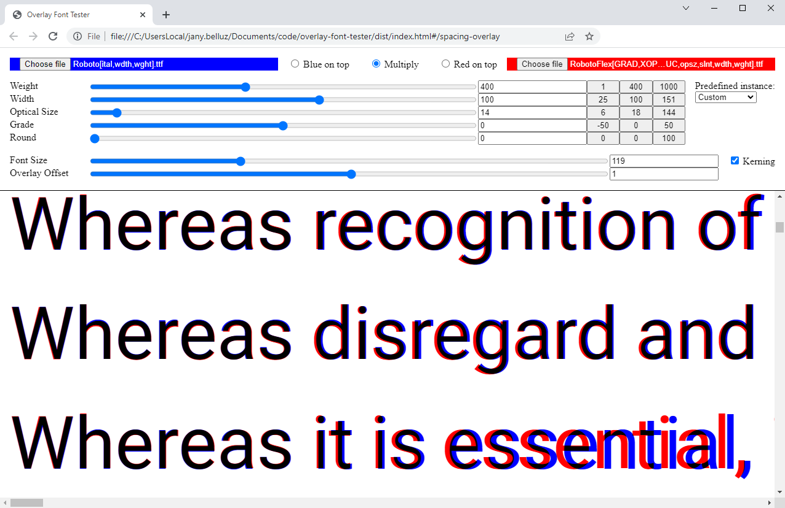

# overlay-font-tester

Project goal: compare two fonts visually by overlaying them. Drop one font
on the red widget and another on the blue.

Known limitation: the sliders and instances are hardcoded; they could be instead
extracted from the dropped fonts automatically. 



## Development notes from the Vue project template

This template should help get you started developing with Vue 3 in Vite.

### Recommended IDE Setup

[VSCode](https://code.visualstudio.com/) + [Volar](https://marketplace.visualstudio.com/items?itemName=Vue.volar) (and disable Vetur) + [TypeScript Vue Plugin (Volar)](https://marketplace.visualstudio.com/items?itemName=Vue.vscode-typescript-vue-plugin).

### Type Support for `.vue` Imports in TS

TypeScript cannot handle type information for `.vue` imports by default, so we replace the `tsc` CLI with `vue-tsc` for type checking. In editors, we need [TypeScript Vue Plugin (Volar)](https://marketplace.visualstudio.com/items?itemName=Vue.vscode-typescript-vue-plugin) to make the TypeScript language service aware of `.vue` types.

If the standalone TypeScript plugin doesn't feel fast enough to you, Volar has also implemented a [Take Over Mode](https://github.com/johnsoncodehk/volar/discussions/471#discussioncomment-1361669) that is more performant. You can enable it by the following steps:

1. Disable the built-in TypeScript Extension
    1) Run `Extensions: Show Built-in Extensions` from VSCode's command palette
    2) Find `TypeScript and JavaScript Language Features`, right click and select `Disable (Workspace)`
2. Reload the VSCode window by running `Developer: Reload Window` from the command palette.

### Customize configuration

See [Vite Configuration Reference](https://vitejs.dev/config/).

### Project Setup

```sh
npm install
```

#### Compile and Hot-Reload for Development

```sh
npm run dev
```

#### Compile and Minify for Production

Note: (Jany) There are typing issues (the Vue.js 2 types are not great),
so I recommend using `build-only` instead of `build` to sidestep the typing.

```sh
npm run build-only
```

Then grab the file `dist/index.html`. You should be able to use this file by
double-clicking on it, and distribute it to others so they can do the same.

#### Lint with [ESLint](https://eslint.org/)

```sh
npm run lint
```
